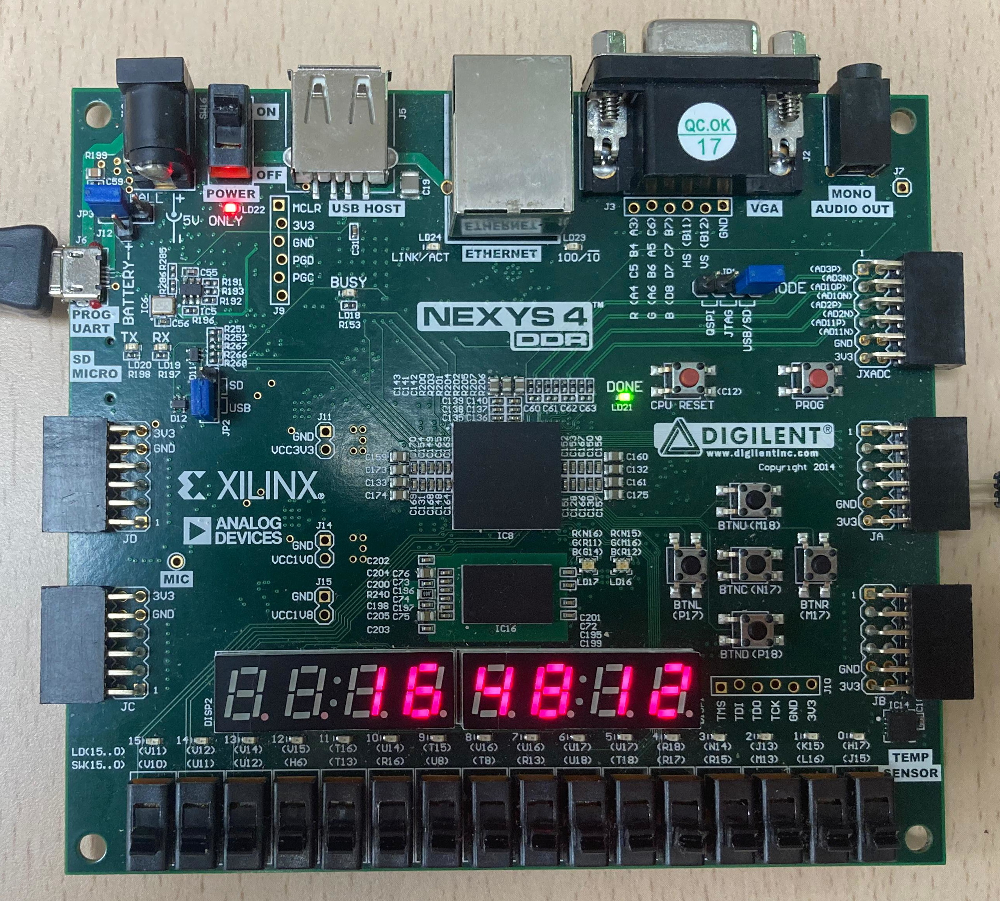
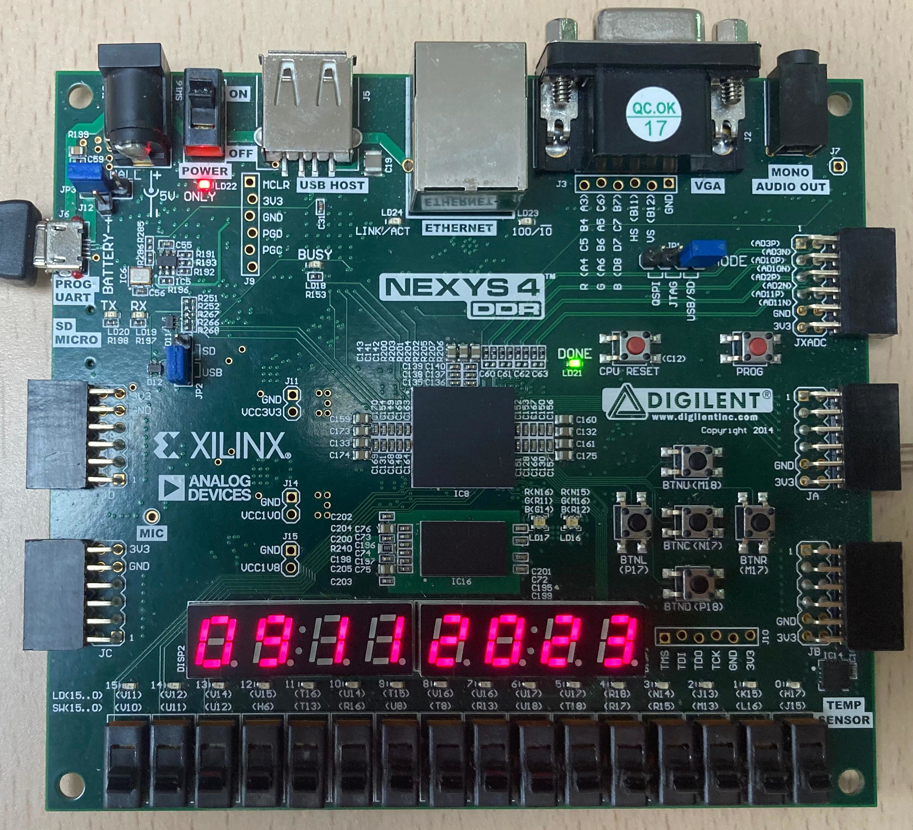

# Trabajo-SED-VHDL

Trabajo-SED-VHDL

Sistemas Electrónicos Digitales  
Trabajo VHDL  
Curso 23/24  
Placa de desarrollo: Nexys 4 DDR Artix-7  

Pablo Nuñez Hernández (54773)  
Sara de Vargas Muller (53919)  
Andrés Fernández Muñoz (55237)  
   

Time

 

Date

 

